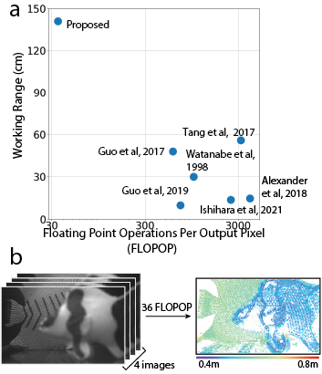
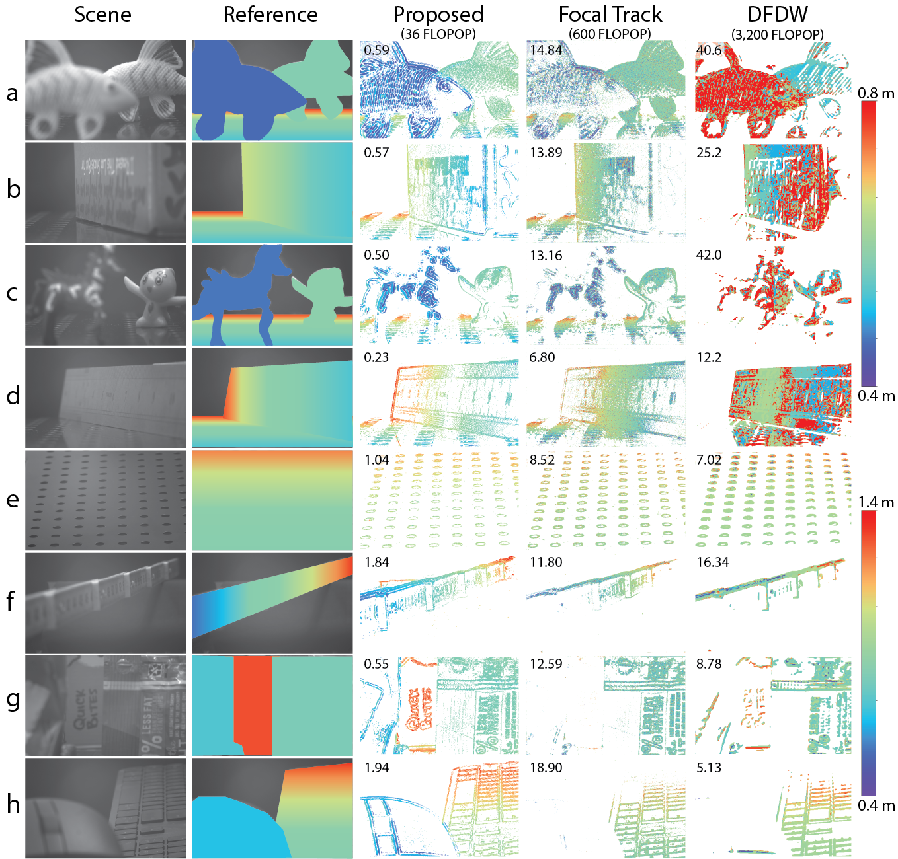
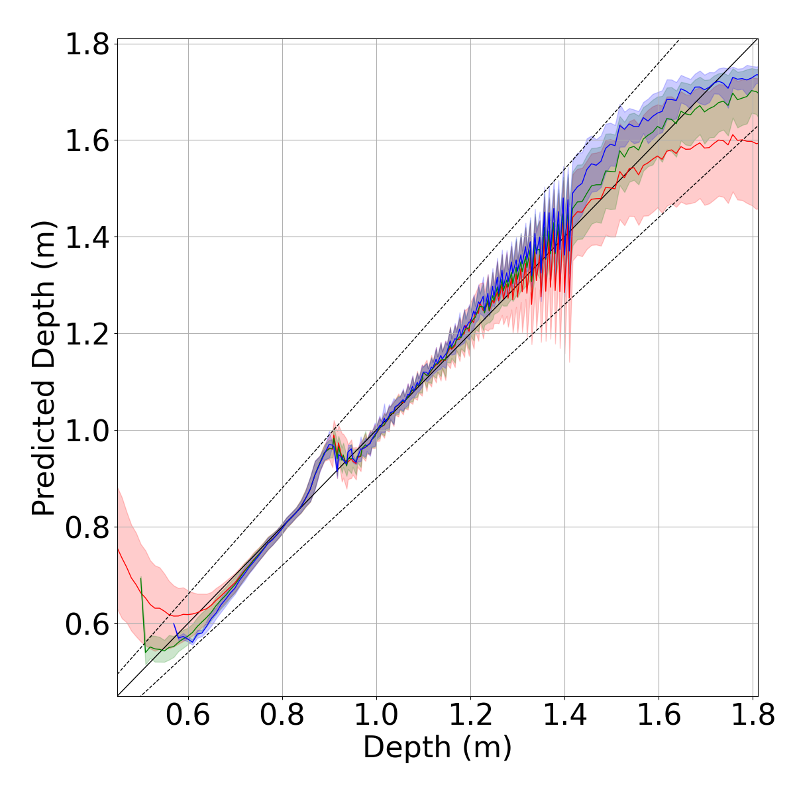

# Depth From Coupled Optical Differentiation

Junjie Luo, Yuxuan Liu, [Emma Alexander](https://alexander.vision/)* and [Qi Guo](https://qiguo.org)*

Elmore Family School of Electrical and Computer Engineering, Purdue University

Contact: luo330@purdue.edu

<a href="https://arxiv.org/abs/2409.10725" title="arXiv">**arXiv**</a> | <a href="https://purdue0-my.sharepoint.com/:f:/g/personal/luo330_purdue_edu/Eqxeyz0W62FAu7L3buISZ60BY4wrYySyatZmiSCofLhLrA?e=SWUwaS" title="COD Dataset">**COD Dataset**</a>

**Content**

- [0 Introduction](#0-introduction)
- [1 Usage](#1-usage)
  * [1.1 Quick start](#11-quick-start)
  * [1.2 Depth Map](#12-depth-map)
  * [1.3 Heatmap](#13-heatmap)
- [2 Results](#2-results)
  * [2.1 Depth Map](#21-depth-map)
  * [2.2 Heatmap](#22-heatmap)
- [3 Citation](#3-citation)
## 0 Introduction

We propose depth from coupled optical differentiation, a low-computation passive-lighting 3D sensing mechanism. It is based on our discovery that per-pixel object distance can be rigorously determined by a coupled pair of optical derivatives of a defocused image using a simple, closed-form relationship. Unlike previous depth-from-defocus (DfD) methods that leverage spatial derivatives of the image to estimate scene depths, the proposed mechanism's use of only optical derivatives makes it significantly more robust to noise. Furthermore, unlike many previous DfD algorithms with requirements on aperture code, this relationship is proved to be universal to a broad range of aperture codes.

We build the first 3D sensor based on depth from coupled optical differentiation. Its optical assembly includes a deformable lens and a motorized iris, which enables dynamic adjustments to the optical power and aperture radius. The sensor captures two pairs of images: one pair with a differential change of optical power and the other with a differential change of aperture scale. From the four images, a depth and confidence map can be generated with only 36 floating point operations per output pixel (FLOPOP), more than ten times lower than the previous lowest passive-lighting depth sensing solution to our knowledge. Additionally, the depth map generated by the proposed sensor demonstrates more than twice the working range of previous DfD methods while using significantly lower computation.


<p align="center">
  
</p>

(a) Technological advantages of the proposed method. We plot the computational complexity, measured in floating point operations per output pixel (FLOPOP), and the working range of a series of efficient monocular, passive-lighting depth sensors. The proposed solution achieves a significantly lower computational complexity and longer working range compared to the previous best. (b) System diagram. The proposed depth sensor captures four images of a fixed scene with different optical settings and produces a sparse depth map with only 36 FLOPOP.

## 1 Usage

### 1.1 Quick start
To run the code with [conda](https://www.anaconda.com/download), please follow the prompts below. 

```
git clone https://github.com/guo-research-group/cod.git
conda create -n COD python=3.11
conda activate COD
pip3 install -r requirements.txt
```

After downloading and unzipping the dataset and pretrained weights, the full folder content is shown below.

```
COD
|   LICENSE.md
|   README.md
|   requirements.txt
|   ...
|---src
|   |   depthmap.py
|   |   heatmap.py
|   ...
|---img
|   |   Teaser.png
|   |   Result.png
|   ...
|---data
|   |   **Please download datasets from the link and copy them to here**
|   |   Motorized_LinearSlide_Texture5_NewParameter.pkl
|   |   Motorized_SingleScene_Allmethods_Close_Box.pkl
|   |   ...
|   ...
```

*Please download the dataset from [here](https://purdue0-my.sharepoint.com/:f:/g/personal/luo330_purdue_edu/Eqxeyz0W62FAu7L3buISZ60BY4wrYySyatZmiSCofLhLrA?e=SWUwaS) and move it to **data** folder if you do not prepare your own dataset.*

### 1.2 Depth Map Generation
Please run the following prompts to obtain the example depth map. There are eight scenes in the provided dataset in total.
```
python ./src/depthmap.py
```
If you want to use your own dataset, please follow comments in the code to modify the script and calculate depth maps. 4 input images and parameters (the flange focal distance, the optical power and the aperture radius) are required, as following:
```
imgSigmaPlus = dataDicts[0][SigmaPlusIndex][rhoIndex]["Img"].astype(np.float64)       # I(rho, A + Delta A)
imgSigmaMinus = dataDicts[0][SigmaMinusIndex][rhoIndex]["Img"].astype(np.float64)     # I(rho, A - Delta A)
imgrhoPlus = dataDicts[0][SigmaIndex][rhoPlusIndex]["Img"].astype(np.float64)         # I(rho + Delta rho, A)
imgrhoMinus = dataDicts[0][SigmaIndex][rhoMinusIndex]["Img"].astype(np.float64)       # I(rho - Delta rho, A)

params = {
    "rho": 8.9 + rhoLens,       # Optical Power (rhoPlus + rhoMinus) / 2
    "Sigma": 0.0025,            # Aperture Radius (SigmaPlus + SigmaMinus) / 2
    "Delta_rho": 0.06,          # (rhoPlus - rhoMinus) / 2
    "Delta_Sigma": 0.0010,      # (SigmaPlus - SigmaMinus) / 2
    "sensorDistance": 0.1100,   # Flange focal distance
}
```
### 1.3 Depth Sensing Accuracy Evaluation
Please run the following prompts to obtain a heatmap that indicate the accuracy of depth sensing, as shown in Figure 10 in the [paper](https://arxiv.org/abs/2409.10725). We used to evaluate the method by a fronto parallel texture. You can write your own code based on **depthmap.py**.
```
python ./src/heatmap.py
```

## 2 Result

### 2.1 Depth Maps

If you follow operations in section 1.2 and run the script with our dataset, you can obtain the third column (Proposed) in the following figure.

<p align="center">
  
</p>

Depth maps of real scenes. A reference depth map for each scene estimated from manual measurement is provided in the second column. We compare the proposed method, [Focal Track](https://vision.seas.harvard.edu/focaltrack/), and [DfDW](https://www.dgp.toronto.edu/WildDFD/) under two different working ranges, corresponding to offset optical power $\rho = 10.7\;\text{dpt}$ (a-d) and $10.1\;\text{dpt}$ (e-h). All methods use the same optical parameters and receptive field for each scene. Each depth map is filtered by the method's confidence metric. We set a constant confidence threshold for each method, $C_{\text{thre}} = 0.25, 0.7, 2500$ for ours, Focal Track, and DfDW so that the sparsity of each method's depth map is similar. The abnormal predictions of DfDW (red pixels) are due to the PSF being larger than the receptive field. The number listed in each depth map is the MAE (cm) of the confident depth predictions compared to the reference depth map. The proposed method consistently generates the most accurate depth maps while costing considerably less computation than the other two.

### 2.2 Heatmap

<p align="center">
  
</p>

Depth prediction accuracy on real data. The solid curves indicate the mean predicted depth, and the half-widths of the color bands represent the mean deviation in prediction at each true depth.

## 3 Citation
```
@article{luo2024depth,
  title={Depth from Coupled Optical Differentiation},
  author={Luo, Junjie and Liu, Yuxuan and Alexander, Emma and Guo, Qi},
  journal={arXiv preprint arXiv:2409.10725},
  year={2024}
}
```