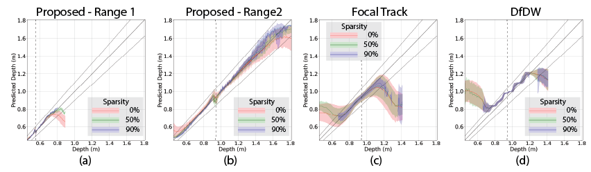

# Depth From Coupled Optical Differentiation

Junjie Luo, Yuxuan Liu, [Emma Alexander](https://alexander.vision/)* and [Qi Guo](https://qiguo.org)*

Elmore Family School of Electrical and Computer Engineering, Purdue University

Contact: luo330@purdue.edu

<a href="https://arxiv.org/abs/2409.10725" title="arXiv">**arXiv**</a> | <a href="https://arxiv.org/abs/2409.10725" title="COD Dataset">**COD Dataset**</a>

**Content**

- [0 Introduction](#0-introduction)
- [1 Usage](#1-usage)
  * [1.1 Quick start](#11-quick-start)
  * [1.2 Depth Map](#12-depth-map)
  * [1.3 Heatmap](#13-heatmap)
- [2 Results](#2-results)
  * [2.1 Depth Map](#21-depth-map)
  * [2.2 Heatmap](#22-heatmap)

## 0 Introduction

We propose depth from coupled optical differentiation, a low-computation passive-lighting 3D sensing mechanism. It is based on our discovery that per-pixel object distance can be rigorously determined by a coupled pair of optical derivatives of a defocused image using a simple, closed-form relationship. Unlike previous depth-from-defocus (DfD) methods that leverage spatial derivatives of the image to estimate scene depths, the proposed mechanism's use of only optical derivatives makes it significantly more robust to noise. Furthermore, unlike many previous DfD algorithms with requirements on aperture code, this relationship is proved to be universal to a broad range of aperture codes.

We build the first 3D sensor based on depth from coupled optical differentiation. Its optical assembly includes a deformable lens and a motorized iris, which enables dynamic adjustments to the optical power and aperture radius. The sensor captures two pairs of images: one pair with a differential change of optical power and the other with a differential change of aperture scale. From the four images, a depth and confidence map can be generated with only 36 floating point operations per output pixel (FLOPOP), more than ten times lower than the previous lowest passive-lighting depth sensing solution to our knowledge. Additionally, the depth map generated by the proposed sensor demonstrates more than twice the working range of previous DfD methods while using significantly lower computation.


<p align="center">
  
</p>

## 1 Usage

### 1.1 Quick start
To run the code with [conda](https://www.anaconda.com/download), please follow the prompts below. 

```
git clone https://github.com/guo-research-group/cod.git
conda create -n COD python=3.11
conda activate COD
pip3 install -r requirements.txt
```

After downloading and unzipping the dataset and pretrained weights, the full folder content is shown below.

```
COD
|   LICENSE.md
|   README.md
|   ...
|---src
|   |   depthmap.py
|   |   heatmap.py
|   ...
|---img
|   |   Teaser.png
|   |   Result.png
|   ...
|---data
|   |   Please download datasets from the link and copy them to here
|   |   Motorized_LinearSlide_Texture5_NewParameter.pkl
|   |   Motorized_SingleScene_Allmethods_Close_Box.pkl
|   |   ...
|   ...
```

### 1.2 Depth Map
Please run the following prompts to obtain the example depth map. There are eight example datasets in total.
```
python ./src/depthmap.py
```
Please follow comments in the code to modify the script and calculate depth maps. 4 input images and parameters (the flange focal distance, the optical power and the aperture radius) are required, as following:
```
imgSigmaPlus = dataDicts[0][SigmaPlusIndex][rhoIndex]["Img"].astype(np.float64)       # I(rho, A + Delta A)
imgSigmaMinus = dataDicts[0][SigmaMinusIndex][rhoIndex]["Img"].astype(np.float64)     # I(rho, A - Delta A)
imgrhoPlus = dataDicts[0][SigmaIndex][rhoPlusIndex]["Img"].astype(np.float64)         # I(rho + Delta rho, A)
imgrhoMinus = dataDicts[0][SigmaIndex][rhoMinusIndex]["Img"].astype(np.float64)       # I(rho - Delta rho, A)

params = {
    "rho": 8.9 + rhoLens,       # Optical Power (rhoPlus + rhoMinus) / 2
    "Sigma": 0.0025,            # Aperture Radius (SigmaPlus + SigmaMinus) / 2
    "Delta_rho": 0.06,          # (rhoPlus - rhoMinus) / 2
    "Delta_Sigma": 0.0010,      # (SigmaPlus - SigmaMinus) / 2
    "sensorDistance": 0.1100,   # Flange focal distance
}
```
### 1.3 Heatmap
Please run the following prompts to obtain heatmap which is used to evaluate the method by a fronto parallel texture. You can write your own code based on **depthmap.py**.
```
python ./src/heatmap.py
```

## 2 Result

### 2.1 Depth Map

<p align="center">
  
</p>

### 2.2 Heatmap

<p align="center">
  
</p>